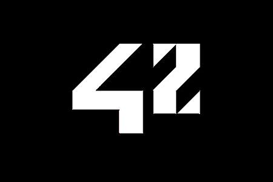

<div align="center">
  
  <h1>So_long</h1>
  <p>🚀 Thank you for the fish!</p>
  
<pr> 
</div>

## 👀 Preview
This project is a small 2D game with minilibx. You'll learn about textures, sprites and tiles.


## 👀 Objectives
It's time for you to tackle your first graphic project!
so long will give you the basics in the following skills: window management, event management, choice of colors and textures.
You will now be able to use the school's graphic library: the MiniLibX! This library was developed in-house and includes basic tools for opening a window, creating images and managing keyboard and mouse events.
The objectives of this project are similar to those of your first year: to be rigorous, to improve your C programming skills, to use basic algorithms, to search for information independently, etc. ...

## 👀 Rules
Your project must respect the following rules:
- You must use MiniLibX. Either the version available on the school's machines, or by installing it from source.
- You must make a Makefile that will compile your source files. It must not relink.
- Your program must take as parameter a map file ending with the extension .ber.

## 👀 The game
- The player's goal is to collect all the items on the map, and then escape by taking the shortest possible route.
- The W, A, S and D keys must be used to move the main character.
- The player must be able to move in these 4 directions: up, down, left, right.
- The player must not be able to move in the walls.
- At each movement, the total movement count must be displayed in the
shell.
- You must use a 2D view (top or profile view).
- The game does not have to be in real time.
- Although the examples given show a dolphin theme, you are free to create the universe you want.

## 👀 Graphic management
- Your program must display an image in a window.
- The management of the window must remain fluid (change the window, reduce it, etc.).
- Pressing the ESC key should close the window and quit the program itself.
- Clicking on the top cross of the window should close the window and exit the program cleanly.
- The use of MiniLibX images is mandatory.

## 👀 The map
- The map will be built using 3 elements: the walls, the items to collect
and the empty space.
- Your map can be composed of these 5 characters: 0 for an empty space
1 for a wall,
C for a collectable item (C for collectible),
E for exit (E for exit),
P for the starting position of the character.
Example of a basic card:

```1111111111111```

```10010000000C1```

```1000011111001```

```1P0011E000001```

```1111111111111```


- The map must contain at least 1 exit, 1 item and 1 starting position.
- The map must be rectangular in shape.
- The map must be closed by being framed by walls. If this is not the case, the program returns an error.
- You do not have to check whether there is a valid path (i.e. one that can be taken) in the map.
- You should be able to parse any type of map as long as it respects the rules stated above.
- Another example of a basic .ber map :

```1111111111111111111111111111111111```

```1E0000000000000C00000C000000000001```

```1010010100100000101001000000010101```

```1010010010101010001001000000010101```

```1P0000000C00C0000000000000000000C1```

```1111111111111111111111111111111111```

If a configuration error is detected, the program should exit cleanly and return "Error" followed by an explicit error message of your choice.

## 👀 Game

<div align="center">
  
<pr> 
</div>
<!--badges : https://badge42.vercel.app-->
